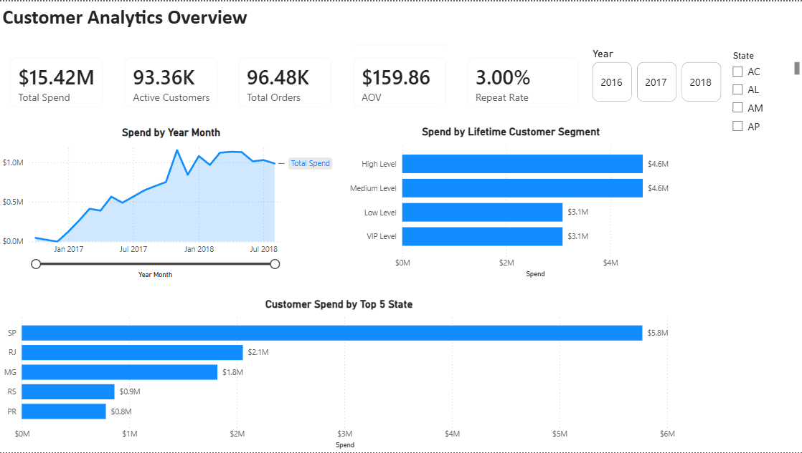
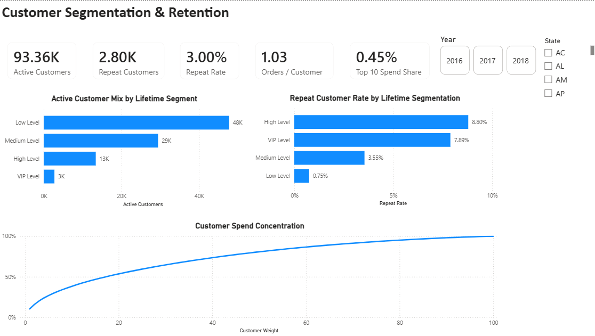

Olist Customer Analytics

Customer analytics project using PostgreSQL and Power BI to analyze customer spending, segmentation, retention, and geographic performance.

Tools

- PostgreSQL
- Power BI
- Power Query
- DAX

Project Work

- Designed customer, product, and location dimensions with order and order-item fact tables using SQL.
- Cleaned customer and location data and handled missing and unmatched records.
- Created surrogate keys for reporting and established relationships between reporting tables.
- Calculated customer lifetime spend, first and last order dates, and cumulative spend for value-based customer segmentation.
- Built Power BI reports covering spend, active customers, AOV, repeat rate, customer segments, and geographic performance.

Dashboard

Customer Overview

Customer Segmentation & Retention

